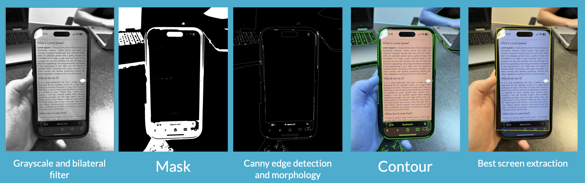
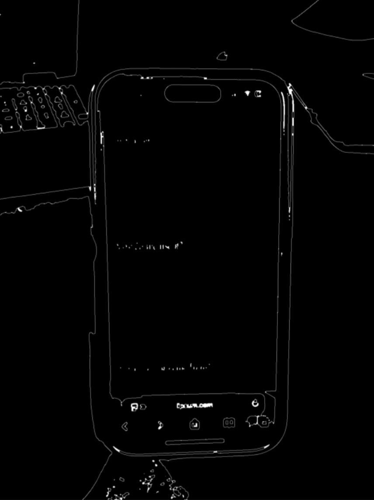
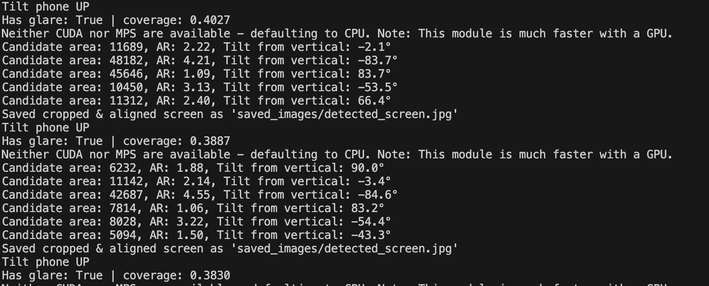
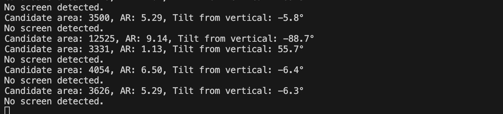
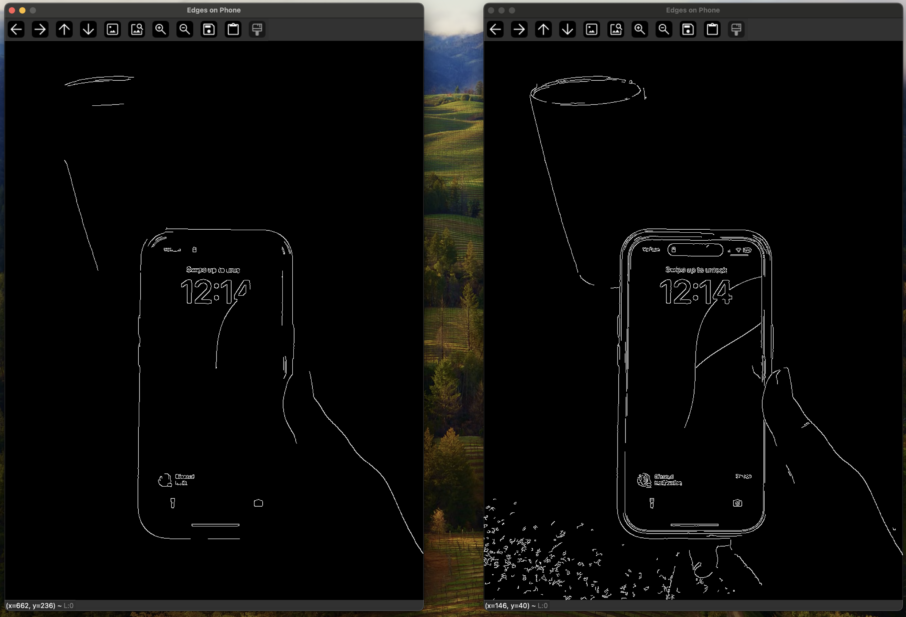

# machine-vision

Tabitha Davison, Lily Wei, Ashley Yang

# Project Goal

The goal of our project was to isolate, learn about, and create a computer vision-based subsystem that could be used to aid elderly or low vision people with navigating their smartphones, who often struggle to locate or read text on their device. 

In the ideal vision of our project in a full ecosystem, our user would be wearing some kind of smart glasses with a built-in first-person perspective camera. This camera would give live feedback of the person’s phone as they are using it; the camera would recognise the phone screen, detect the text on the screen, and give feedback on how the user can move their phone to allow for better screen visibility if there is glare on the phone screen. Using the text on the screen, our smart glasses would be able to direct the user to better navigate using their phone, such as where to click on an app to perform a certain action.

For the scope of this project specifically, we focused on working with the first-person perspective camera and developing a computer vision pipeline that could recognize and isolate the phone screen, detect the text, and give feedback on glare and user phone placement. Essentially, we focused on techniques behind object detection and Optical Character Recognition (OCR) in order to achieve the sensory portion, as well as foraying into the feedback portion, of our imagined smart glasses system.

The inspiration for this project came from members of our team having involvement in Olin’s Pl(ai) Lab with Andrea Cuadra, as well as in Olin’s Accessibility Lab and working on StepNavigation with Paul Ruvolo.

# Problem Approach / Solution

We approached this problem by first developing a high level pipeline for our project, chunking our project into three main steps:

- Phone screen detection
- Glare detection algorithm
- OCR algorithm

## Screen Detection

Fig 1: Result after each step of pipeline

For screen detection, we used OpenCV to build a pipeline that identifies regions in an image that could be the phone screen and extracts the most likely one, turning it into a JPEG. Below, is an explanation for what our pipeline does to reach each of the output images in Fig 1.

Step 1: First, the image gets converted to grayscale to simplify it. We then run histogram equalization on it to enhance contrast by darkening dark regions and lightening light regions. 

Step 2: After that, a bilateral filter gets applied to reduce noise while preserving edges. A mask is then applied to isolate dark regions, thresholding the image so it only preserves areas that are below a certain darkness. 

Step 3: Canny edge detection is then run on the clean mask image to extract boundaries.  Morphology is then applied to close any gaps between the edges, which works through a dilation and erosion step; dilation expands the bright white regions of the edges to connect any erroneous gaps, while erosion then shrinks them back while preserving the new edge connections.  Below is an enhanced version of the image in Fig 2.

<!--  -->

Fig 2: Enhanced image of edge detection

Step 4: Contours are extracted from the edge detection image. 

Step 5: For each contour, a rectangle is extracted. Each region extracted is evaluated based on area, aspect ratio, and tilt from vertical. The region that is above the minimum area, within our max tilt constraints of 20 degrees, and closest to the desired aspect ratio of 16:9 (portrait mode aspect ratio) is selected as the screen region.

Step 6 (not depicted in Fig 1): The final step is to save the image. The selected rectangle region then has its points reordered to ensure the image gets saved in the correct orientation. A perspective transform is applied to deskew the image. This creates a properly oriented and aligned image of a phone screen, or what the pipeline thinks is the phone screen. Finally, it saves the image.

## Glare Detection 

Fig 3: different maps and masks for determining glare

For the glare-detection component of our screen-reader project, we used OpenCV and Numpy to build a pipeline that identifies glare by analyzing three visual “maps” of the phone screen: intensity, saturation, and local contrast. First, the image is converted to HSV so we can look at brightness and color information separately. Glare tends to be extremely bright, low in color, and low in detail, so we computed a brightness map, a saturation map, and a local-contrast map. Each of these maps highlights a different signature of glare, and by weighting and combining them, the algorithm produces a single glare-score image and a binary glare mask. From this, we can detect whether glare is present, estimate its coverage, and locate its position for giving movement instructions.

Given these calculations, we output the results and our recommendations for movement instructions into the terminal, such as in Fig 5 below:

Fig 5: Terminal Output with Glare and Movement Recommendation

As can be seen, we receive recommendations on which direction to tilt the phone in order to reduce glare, as well as a few metrics of whether there is glare or not and what the glare coverage is.

In the case that our screen detection pipeline determines that there is not a screen detected, we also give this feedback in the terminal, as shown in Fig 6 below:

## OCR Algorithm 

We had to choose which OCR library to build our screen-reader pipeline around, and compared EasyOCR, Tesseract, and PaddleOCR before deciding on EasyOCR.
We tested Tesseract, since it is well-documented, but in testing, it was sensitive to blur, glare, and perspective distortion on phone screens. The images need a lot of pre-processing (binarization, threshold tuning, careful cropping), adding complexity to the live feed. We also looked at PaddleOCR, which has very high accuracy, but its setup is heavier, it takes too long to run, and the docs/community support we found were more fragmented and less beginner-friendly for our timeline.
We ultimately chose EasyOCR, since it gave the best performance on our actual use case: text on a phone screen with reflections, odd fonts, and tilted angles. It was simple to integrate, ran reasonably fast, and handled noisy, real-world images without heavy custom pre- or post-processing. 

# Design Decision(s)

There were multiple rounds of comparison and decisions that went into what steps in our pipeline we ended up finalizing for our screen detection. For example, as shown in the image below, we tested the effect of the denoising step for our pipeline, by comparing the edge detected when we didn’t include a bilateral filter over our image (left) versus when we used a bilateral filter (right). As can be seen, the edges of our phone screen target are picked up much more with a bilateral filter than without, which informed our decision to include a bilateral filter to remove noise and create more pronounced edges of the screen.

Fig 4: Left image shows processing without bilateral filtering. Right shows it with

Additionally, with our choice of denoising filter, we decided to go with a bilateral filter specifically because it fits our use case of picking out edges in the following step. While OpenCV also has options such as a simple averaging box filter, Gaussian filter, and a median averaging filter, we chose the bilateral filter because of the way it only averages pixels that are both close spatially and in color intensity to central pixels of the kernel, which ends up smoothing images within regions while preserving edges more effectively than other types of filtering.

# Challenges

We initially had a challenge with the screen detection implementation, as the algorithm was initially grabbing darkly coloured or rectangular shaped objects to be phone screens. Before we added in the tilt from vertical constraint for detecting the screen, there would sometimes be rectangular regions that better fit the desired aspect ratio but weren’t the phone screen. We realized that these areas were often very tilted. Since we usually held the phone screen in our testing in portrait mode, we added a new constraint that checked for tilt from vertical. This added in a limitation of pipeline as it means that our pipeline will not properly process phones held in a landscape position but it drastically improved our screen detection rate for portrait mode phones.

Figuring glare detection was challenging, because there are many techniques, such as simple brightness thresholding, which proved to not be able to handle more anything beyond a screenshot, sharper edge-based techniques like using the Laplacian operator to detect regions with unusually low high-frequency detail, which proved complicated to implement, and ML-driven classification. Choosing a method that worked reliably across photos required a lot of iteration. Even after settling on our final approach, fine tuning the parameters was challenging. We had to experiment with the window size for local contrast, the weights assigned to each map, the HSV thresholds for brightness and saturation, and the final glare-score cutoff that determines whether glare is present. Small changes in any of these values could make the algorithm either too sensitive or not sensitive enough, so dialing them in to make the system robust took significant testing.

# Project Improvements or Extensions

It would have been really cool to implement PID control when implementing feedback on the phone’s position in response to glare. If there had been more time for this project, we would have loved to implement a mechanism that could tilt the phone to the optimal angle and position to reduce glare for better OCR ability. The article we looked at for phone glare also had sections showing other methods for determining an image’s quality and blur, which could have been interesting to take further, since they also impact how readable an image is for OCR.

If we had more time, we would also try to get the screen reader to work on not only phones held in portrait mode but also phones held in landscape mode.

Additionally, given more time, we would clean up our output.txt, as currently our OCR will output each chunk it processes onto a separate line.

# Future Programming & Project Learnings

We learned a lot about how to structure a more complex robotics pipeline and the importance of testing each stage as we built it. Iterating from static screenshots, to photos of a phone screen, and finally to a live video feed made the development process much smoother and helped us catch issues early.
We also gained a deeper understanding of optical character recognition (OCR) and the tradeoffs between different OCR methods. That knowledge is widely applicable to many real-world perception problems - everything from autonomous vehicles reading road signs to systems that analyse handwriting or extract information from the environment.
Finally, the work we did on phone-edge detection and bounding boxes gave us practical experience in object localization, which is foundational in many robotics and computer vision applications. Those skills will almost certainly carry over into future projects involving tracking, recognition, or scene understanding.

# Demo Link:
Screen Reader Demo:
https://drive.google.com/file/d/1NLBEL2s62fnqZY55xzfMGWQuipZx1qxW/view?usp=sharing   

Full Live Pipeline with OCR Output:
https://drive.google.com/file/d/1ITCo3i7tZEk4x0AQhQZhDCCxjOTwvPuJ/view?usp=share_link 

# Running Our Project

To run our project, the libraries outside in the requirements.txt file (numpy, cv2, easyocr) are needed. Though `pip install -r requirements.txt` may be run to install these libraries, this .txt file is mostly there for easy dependency reference, as we each installed these dependencies in different ways (conda, pip, etc.).

To run the live feed pipeline, run the file `live_screen_reader.py` with `python live_screen_reader.py`, which should connect to the webcam on your computer. Or, if running on a Macbook and having an iPhone, enable the share webcam feature with your iPhone to use your iPhone as the first-person camera, which is the approach we took to test and conduct our demo. The detected and cropped phone screen image should go to a generated directory `saved_images` under the name `detected_screen.jpg`, while the output of the OCR detection will be in generated `output.txt`.

To run the still image pipeline, run the file `still_image_screen_reader.py` with `python still_image_screen_reader.py`, and change the path to the desired still image. 
